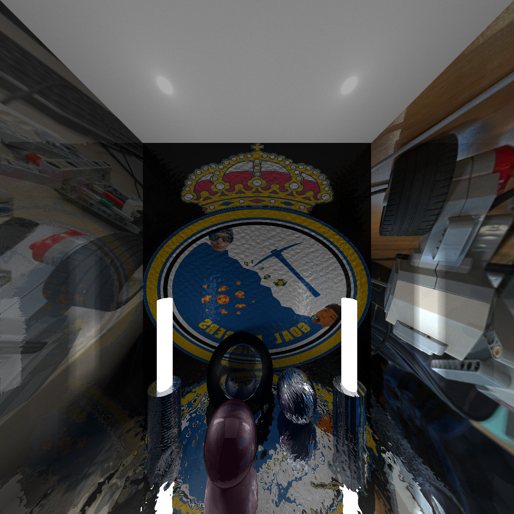

# Advanced Ray Tracer
Full image rendering pipeline that handles complex illumination models and lighting that deals with area light sources, smooth shadows, transparent objects, and more. The Ray Tracer is fully implemented in C.

## Features
* Different surface types such as planes, spheres, and cones
* Point and area light sources
* Phong model illumination
* Antialiasing
* Refraction
* Soft shadows
* Hierarchical object construction
* Texture mapping
* Normal mapping
* Alpha mapping

## Example

## Disclaimer
This implementation is a collective work between Bassel Ashi and Keping Le on a Computer Graphics assignment at the University of Toronto. Please do not use this code in any way that goes against your institution academic integrity.